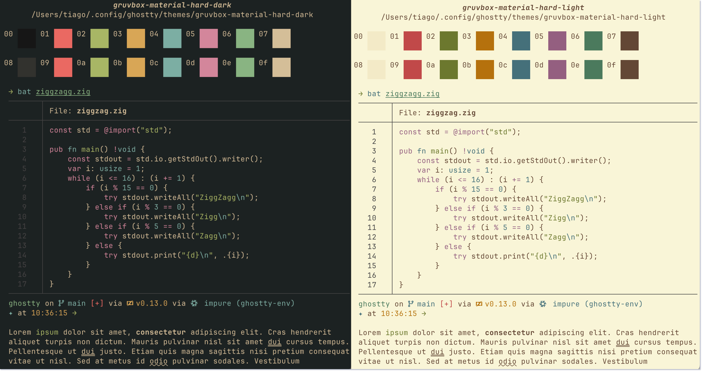

# Gruvbox Material for Ghostty



### How to use:

Copy the `/themes` folder contents of this repo into your `~/.config/ghostty/themes` directory.

#### How to load only Dark/Light:
```
theme = gruvbox-material-hard-dark
```

#### How to load with Dark & Light mode:
```
theme = light:gruvbox-material-hard-light,dark:gruvbox-material-hard-dark
```
